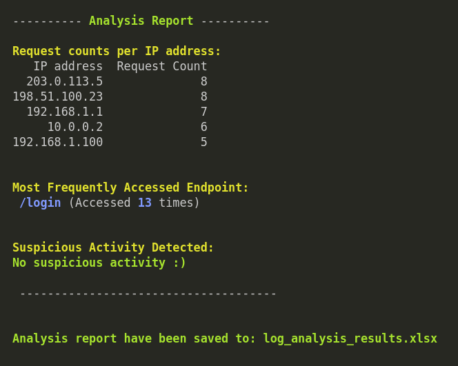

# Log File Analysis and Reporting

This project analyzes a log file and generates a detailed report in CSV format. The generated report includes insights such as IP address request counts, the most frequently accessed endpoint, and suspicious login attempts.

The results are saved in an Excel file `log_analysis_results.xlsx` for easy reference, and the outputs are also displayed in the terminal for quick insights.

---

## Features

- **Log Parsing**: Converts unstructured log data into a structured format using a pandas DataFrame.
- **IP Address Analysis**:
  - Counts the number of requests made by each IP address.
- **Endpoint Analysis**:
  - Identifies the most frequently accessed endpoint.
  - **Additional Functionality**: Displays the frequency of all endpoints if required.
- **Suspicious Activity Detection**:
  - Detects IP addresses with excessive failed login attempts.
- **Output**:
  - Saves the analysis in an Excel file `log_analysis_results.xlsx`.
  - Outputs results in the terminal.

---

## Sample Input and Output

### Input
Provide a log file in the same directory as the script, e.g., `sample.log`.

### Output
1. **Terminal Output**  
   Outputs are displayed in the terminal as shown below:  
   

2. **Excel File Output**  
   The results for the `sample.log` file will be available in the Excel file:  
   **`log_analysis_results.xlsx`**

---

## Installation and Usage

### Prerequisites

- Python 3.7 or later
- Virtual environment (optional but recommended)

### Steps to Run the Project

1. **Clone the Repository**:
   ```bash
    git clone https://github.com/HeetVekariya/vrvsecurity.git
    cd vrsecurity
    ```

2. **Setup Virtual Environment (Optional, but Recommended)**:
   ```bash
    python -m venv venv
    source venv/bin/activate  # For Linux/MacOS
    venv\Scripts\activate     # For Windows
    ```

3. **Install Required Packages**:
   ```bash
    pip install -r requirements.txt
    ```

4. **Run the Script**:
    ```bash
     python log_analysis.py
     ```


